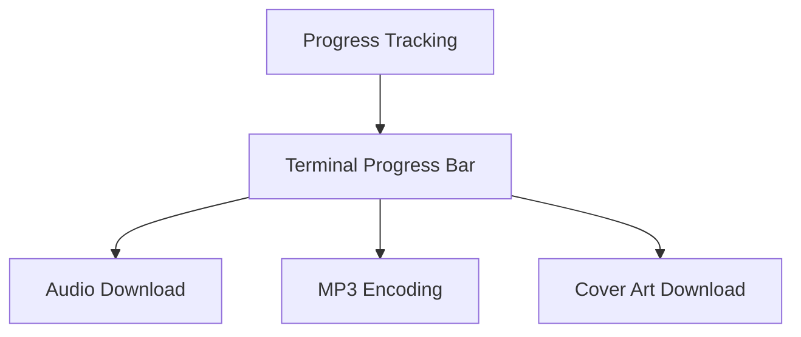
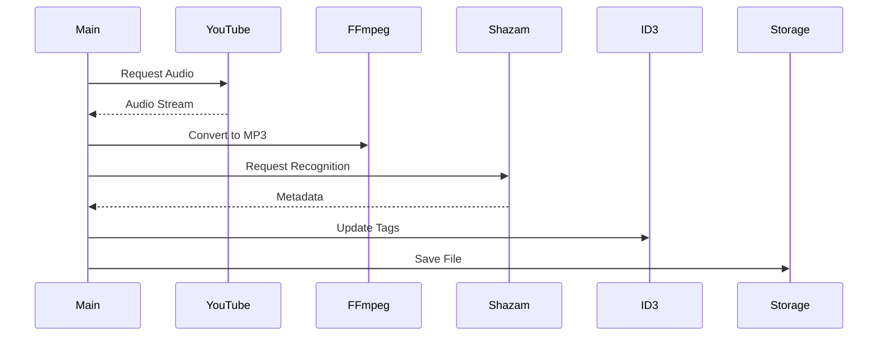
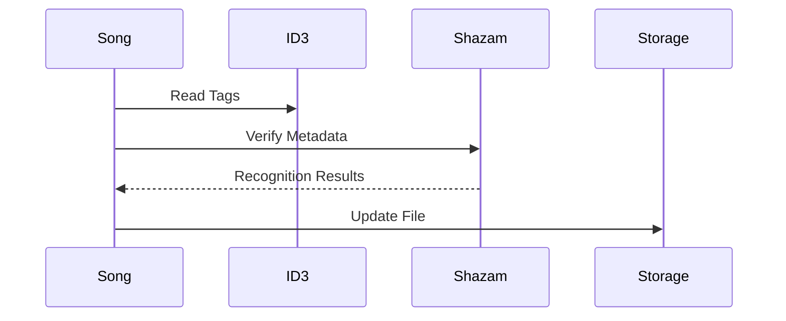

# Core Components

This document details the core components of PYPL2MP3 and their interactions.

## Song Model

The `SongModel` class is the central component for managing song data and operations.

### Key Responsibilities

1. **Audio Processing**
   - YouTube audio stream download
   - MP3 conversion
   - Audio format handling

2. **Metadata Management**
   - ID3 tag handling
   - Cover art management
   - File naming conventions

3. **Song Recognition**
   - Shazam integration
   - Artist/title matching
   - Match score calculation

### Progress Tracking



## Repository Management

The repository system handles:
- Playlist organization
- File system operations
- Storage structure

### Directory Structure
```
repository_root/
├── playlist_id_1/
│   ├── song1.mp3
│   └── song2.mp3
├── playlist_id_2/
│   └── ...
└── pypl2mp3.log
```

## Library Components

### 1. Exception Handling
- Custom exception classes
- Error categorization
- User-friendly messages

### 2. Logging System
- Operation tracking
- Debug information
- Error reporting

### 3. Utility Functions
- String sanitization
- File path handling
- Format conversion

## Data Flow

### Song Import Process


### Metadata Management


## Component Interfaces

### 1. Song Model Interface
```python
class SongModel:
    - Audio download management
    - Metadata handling
    - File operations
    - Tag management
```

### 2. Progress Tracking Interface
```python
class ProgressBarInterface:
    - Download progress
    - Conversion status
    - Operation feedback
```

### 3. Repository Interface
```python
class Repository:
    - Playlist management
    - File organization
    - Storage handling
```

## Event System

1. **Progress Events**
   - Download progress
   - Conversion status
   - Operation completion

2. **Error Events**
   - Network failures
   - Conversion issues
   - Storage problems

## Configuration Management

1. **Environment Variables**
   - Repository path
   - Default playlist
   - Debug settings

2. **Runtime Settings**
   - Match thresholds
   - Operation modes
   - Verbosity levels

## Resource Management

### 1. Temporary Files
- Download buffers
- Conversion workspace
- Cover art cache

### 2. Network Resources
- YouTube connections
- Shazam API calls
- Cover art downloads

### 3. Storage Management
- File cleanup
- Space monitoring
- Cache handling

## Integration Points

1. **External Services**
   - YouTube API integration
   - Shazam recognition
   - File system access

2. **Internal Systems**
   - Command processing
   - Progress tracking
   - Error handling

## External Service Data

### YouTube Playlist Item (example)
```json
{
    "kind": "youtube#video",
    "etag": "WWGfPQYKY85bEvCFG2nYwb1oBVU",
    "id": "krpcRnxVCmA",
    "snippet": {
        "publishedAt": "2015-08-27T14:00:54Z",
        "channelId": "UCFeWEe1ABbRtNPY-WfUw8Uw",
        "title": "Destroyer - Times Square",
        "description": "From the album Poison Season, out August 28, 2015.\nVinyl / CD:  http://smarturl.it/poisonseason\nDownload:  http://smarturl.it/PoisonSeasonDL\n\nDan Bejar: vocals\nTed Bois: piano\nNicolas Bragg: lead guitar\nDavid Carswell: rhythm guitars\nJP Carter: trumpet\nJohn Collins: bass\nJoseph Shabason: saxophone\nJosh Wells: drums, congas, percussion\n\nmixed by David Carswell\n\ndirected and animated by Shayne Ehman\n\nfilm production assistants: Tony Romano, Zoe Gordon, Axel Ehman\n\nWe acknowledge the financial support of Canada\u2019s Private Radio Broadcasters and FACTOR.\n\nhttp://vevo.ly/UWEXhS",
        "thumbnails": {
            "default": {
                "url": "https://i.ytimg.com/vi/krpcRnxVCmA/default.jpg",
                "width": 120,
                "height": 90
            },
            "medium": {
                "url": "https://i.ytimg.com/vi/krpcRnxVCmA/mqdefault.jpg",
                "width": 320,
                "height": 180
            },
            "high": {
                "url": "https://i.ytimg.com/vi/krpcRnxVCmA/hqdefault.jpg",
                "width": 480,
                "height": 360
            },
            "standard": {
                "url": "https://i.ytimg.com/vi/krpcRnxVCmA/sddefault.jpg",
                "width": 640,
                "height": 480
            },
            "maxres": {
                "url": "https://i.ytimg.com/vi/krpcRnxVCmA/maxresdefault.jpg",
                "width": 1280,
                "height": 720
            }
        },
        "channelTitle": "DestroyerVevo",
        "tags": [
            "Destroyer",
            "Times",
            "Square",
            "Merge",
            "Alternative"
        ],
        "categoryId": "10",
        "liveBroadcastContent": "none",
        "defaultLanguage": null,
        "localized": {
            "title": "Destroyer - Times Square",
            "description": "From the album Poison Season, out August 28, 2015.\nVinyl / CD:  http://smarturl.it/poisonseason\nDownload:  http://smarturl.it/PoisonSeasonDL\n\nDan Bejar: vocals\nTed Bois: piano\nNicolas Bragg: lead guitar\nDavid Carswell: rhythm guitars\nJP Carter: trumpet\nJohn Collins: bass\nJoseph Shabason: saxophone\nJosh Wells: drums, congas, percussion\n\nmixed by David Carswell\n\ndirected and animated by Shayne Ehman\n\nfilm production assistants: Tony Romano, Zoe Gordon, Axel Ehman\n\nWe acknowledge the financial support of Canada\u2019s Private Radio Broadcasters and FACTOR.\n\nhttp://vevo.ly/UWEXhS"
        },
        "defaultAudioLanguage": null
    },
    "contentDetails": {
        "duration": "PT4M21S",
        "dimension": "2d",
        "definition": "hd",
        "caption": "false",
        "licensedContent": true,
        "regionRestriction": null,
        "contentRating": {},
        "projection": "rectangular",
        "hasCustomThumbnail": null
    },
    "status": {
        "uploadStatus": "processed",
        "failureReason": null,
        "rejectionReason": null,
        "privacyStatus": "public",
        "publishAt": null,
        "license": "youtube",
        "embeddable": true,
        "publicStatsViewable": true,
        "madeForKids": false,
        "selfDeclaredMadeForKids": null
    },
    "statistics": {
        "viewCount": 369519,
        "likeCount": 2780,
        "dislikeCount": null,
        "commentCount": 111
    },
    "topicDetails": {
        "topicIds": null,
        "relevantTopicIds": null,
        "topicCategories": [
            "https://en.wikipedia.org/wiki/Independent_music",
            "https://en.wikipedia.org/wiki/Music"
        ]
    },
    "player": {
        "embedHtml": "<iframe width=\"480\" height=\"270\" src=\"//www.youtube.com/embed/krpcRnxVCmA\" frameborder=\"0\" allow=\"accelerometer; autoplay; clipboard-write; encrypted-media; gyroscope; picture-in-picture; web-share\" allowfullscreen></iframe>",
        "embedHeight": null,
        "embedWidth": null
    },
    "liveStreamingDetails": null
}
```

### Shazam Recognition Result (example)
```json
{
    "matches":[
        {
            "id":"344549721",
            "offset":63.103769531,
            "timeskew":-0.0058523417,
            "frequencyskew":-9.202957e-05
        }
    ],
    "location":{
        "accuracy":0.01
    },
    "timestamp":1715327819661,
    "timezone":"Europe/Moscow",
    "track":{
        "layout":"5",
        "type":"MUSIC",
        "key":"344549721",
        "title":"Life: Album Minimix",
        "subtitle":"Sigma",
        "share":{
            "subject":"Life: Album Minimix - Sigma",
            "text":"Life: Album Minimix by Sigma",
            "href":"https://www.shazam.com/track/344549721/life-album-minimix",
            "twitter":"I used @Shazam to discover Life: Album Minimix by Sigma.",
            "html":"https://www.shazam.com/snippets/email-share/344549721?lang=en-US&country=GB",
            "snapchat":"https://www.shazam.com/partner/sc/track/344549721"
        },
        "hub":{
            "type":"APPLEMUSIC",
            "image":"https://images.shazam.com/static/icons/hub/ios/v5/applemusic_{scalefactor}.png",
            "options":[
                {
                    "caption":"OPEN IN",
                    "actions":[
                        {
                            "name":"hub:applemusic:subscribe",
                            "type":"applemusicopen",
                            "uri":"https://music.apple.com/subscribe?mttnagencyid=s2n&mttnsiteid=125115&mttn3pid=Apple-Shazam&mttnsub1=Shazam_ios&mttnsub2=5348615A-616D-3235-3830-44754D6D5973&itscg=30201&app=music&itsct=Shazam_ios"
                        },
                        {
                            "name":"hub:applemusic:subscribe",
                            "type":"uri",
                            "uri":"https://music.apple.com/subscribe?mttnagencyid=s2n&mttnsiteid=125115&mttn3pid=Apple-Shazam&mttnsub1=Shazam_ios&mttnsub2=5348615A-616D-3235-3830-44754D6D5973&itscg=30201&app=music&itsct=Shazam_ios"
                        }
                    ],
                    "beacondata":{
                        "type":"open",
                        "providername":"applemusic"
                    },
                    "image":"https://images.shazam.com/static/icons/hub/ios/v5/overflow-open-option_{scalefactor}.png",
                    "type":"open",
                    "listcaption":"Open in Apple Music",
                    "overflowimage":"https://images.shazam.com/static/icons/hub/ios/v5/applemusic-overflow_{scalefactor}.png",
                    "colouroverflowimage":false,
                    "providername":"applemusic"
                }
            ],
            "providers":[
                {
                    "caption":"Open in Spotify",
                    "images":{
                        "overflow":"https://images.shazam.com/static/icons/hub/ios/v5/spotify-overflow_{scalefactor}.png",
                        "default":"https://images.shazam.com/static/icons/hub/ios/v5/spotify_{scalefactor}.png"
                    },
                    "actions":[
                        {
                            "name":"hub:spotify:searchdeeplink",
                            "type":"uri",
                            "uri":"spotify:search:Life%3A%20Album%20Minimix%20Sigma"
                        }
                    ],
                    "type":"SPOTIFY"
                },
                {
                    "caption":"Open in Deezer",
                    "images":{
                        "overflow":"https://images.shazam.com/static/icons/hub/ios/v5/deezer-overflow_{scalefactor}.png",
                        "default":"https://images.shazam.com/static/icons/hub/ios/v5/deezer_{scalefactor}.png"
                    },
                    "actions":[
                        {
                            "name":"hub:deezer:searchdeeplink",
                            "type":"uri",
                            "uri":"deezer-query://www.deezer.com/play?query=%7Btrack%3A%27Life%3A+Album+Minimix%27%20artist%3A%27Sigma%27%7D"
                        }
                    ],
                    "type":"DEEZER"
                }
            ],
            "explicit":false,
            "displayname":"APPLE MUSIC"
        },
        "sections":[
            {
                "type":"SONG",
                "metapages":[
                    
                ],
                "tabname":"Song",
                "metadata":[
                    {
                        "title":"Title",
                        "text":"Life: Album Minimix"
                    }
                ]
            },
            {
                "type":"RELATED",
                "url":"https://cdn.shazam.com/shazam/v3/en-US/GB/iphone/-/tracks/track-similarities-id-344549721?startFrom=0&pageSize=20&connected=",
                "tabname":"Related"
            }
        ],
        "url":"https://www.shazam.com/track/344549721/life-album-minimix",
        "urlparams":{
            "{tracktitle}":"Life%3A+Album+Minimix",
            "{trackartist}":"Sigma"
        },
        "highlightsurls":{
            
        },
        "relatedtracksurl":"https://cdn.shazam.com/shazam/v3/en-US/GB/iphone/-/tracks/track-similarities-id-344549721?startFrom=0&pageSize=20&connected="
    },
    "tagid":"8BED7044-39F5-4EEF-B16C-B7F42B4A81FE"
}
```